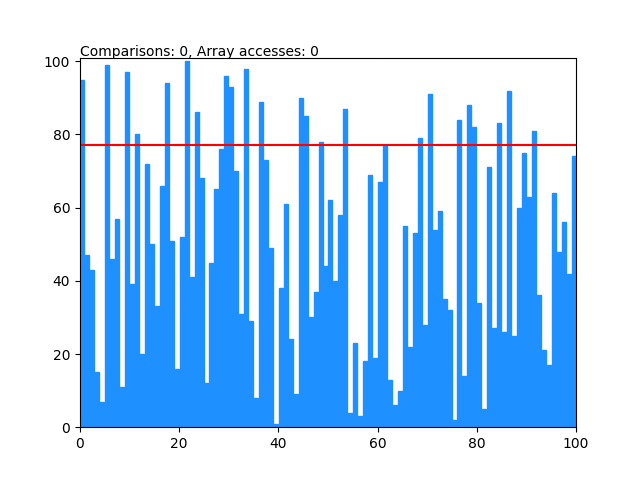

# Sorting algorithms

Sorting algorithm implementation with visualizations.
Array access and comparisons counting probably isn't accurate.

```
usage: main.py [-h] [-n N] [-m M] [-M M] [-r] [--updateTick UPDATETICK] [--noAnim] [{selection,insertion,bubble,shaker,shell,quick}]

positional arguments:
    {selection,insertion,bubble,shaker,shell,quick}
                            What type of sorting algorithm should be used.

options:
    -h, --help            show this help message and exit
    -n N                  Number of elements in an array.
    -m M                  Min element value.
    -M M                  Max element value.
    -r, --random          Generate random values (from uniform distribution) instead of values in range.
    --updateTick UPDATETICK
                          Determines the delay between frame updates.
    --noAnim              Skip the animation & show only the sorted array.
```

<div style='text-align: center;'>
    
</div>